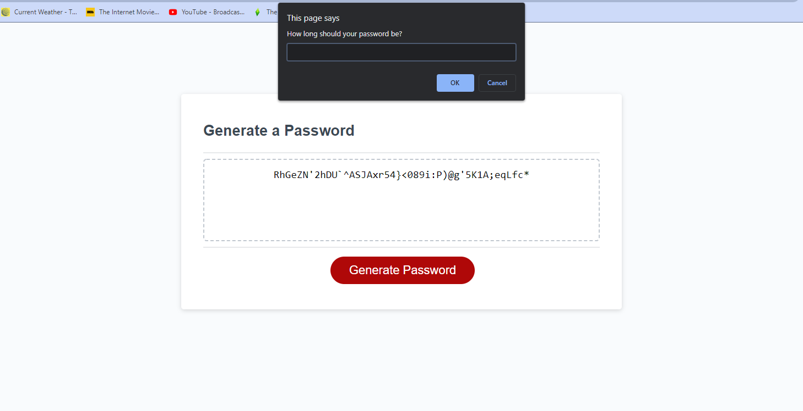
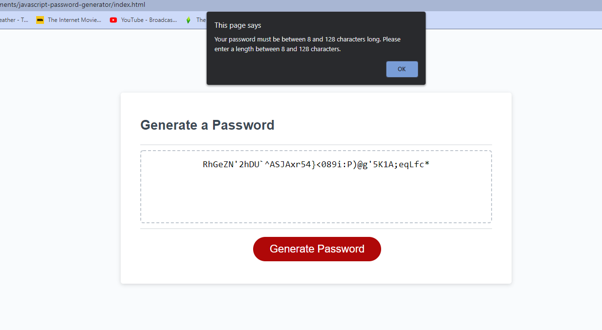

# Homework Assignment #3 - JavaScript Password Generator

This password generator is a homework assignment for the U of T coding bootcamp.

This password generator uses JavaScript functions to generate a random password. The password must be a certain length and must contain at least one of the character criteria to return a valid result.

#Screenshots

https://gleeson-emily.github.io/javascript-password-generator/